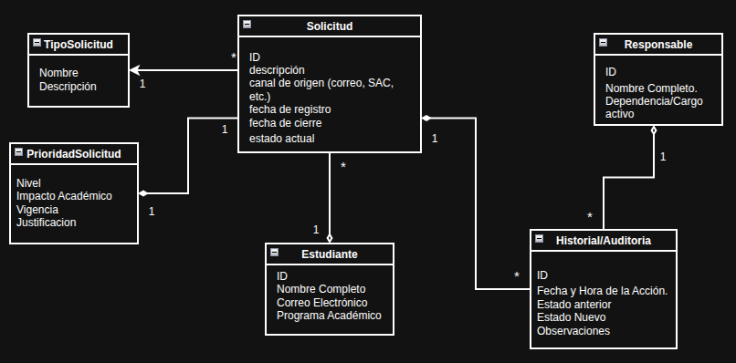

Mariana Ramírez Colorado 
Yamileth Londoño Burgos
Andres Felipe Ospina

# Sistema de Triage y Gestión de Solicitudes Académicas

Este repositorio contiene los entregables correspondientes al Hito 1 del proyecto de Programación Avanzada. El sistema está diseñado para gestionar, clasificar y priorizar las solicitudes académicas del programa de Ingeniería de Sistemas de manera automatizada.

## Contenido del Hito 1

En esta fase se han desarrollado los pilares del diseño del sistema antes de su implementación técnica:

### 1. Modelo de Dominio

Se ha definido la estructura lógica del negocio mediante un diagrama de clases de dominio. Las entidades y relaciones clave incluyen:

* **Estudiante y Funcionario:** Usuarios principales del sistema representados mediante agregaciones, permitiendo su existencia independiente de las solicitudes.
* **Solicitud:** Entidad central que contiene la descripción, canal de origen y estado actual del trámite.
* **Prioridad:** Entidad vinculada a la solicitud mediante composición, encargada de almacenar el nivel de urgencia, impacto y la justificación del triage.
* **Historial/Auditoría:** Registro inalterable de cada acción realizada sobre una solicitud, garantizando la trazabilidad total del proceso.

### 2. Contrato de la API (Especificación OpenAPI 3.1)

Se ha elaborado el contrato de comunicación en formato YAML. Este documento define cómo interactuará el frontend con el backend:

* **Gestión de Solicitudes:** Endpoints para crear (POST) y consultar (GET) trámites.
* **Proceso de Triage:** Endpoints específicos para la clasificación y asignación de prioridad (PUT).
* **Asignación:** Rutas para vincular funcionarios responsables a casos específicos.
* **Seguridad:** Definición de esquemas de autenticación basados en Bearer Token (JWT).

## Tecnologías Utilizadas

* **Java 25**
* **Spring Boot 3.x**
* **Gradle** (Gestión de dependencias)
* **OpenAPI / Swagger** (Documentación técnica)
* **IntelliJ IDEA** (Entorno de desarrollo)

Diagrama de Dominio

